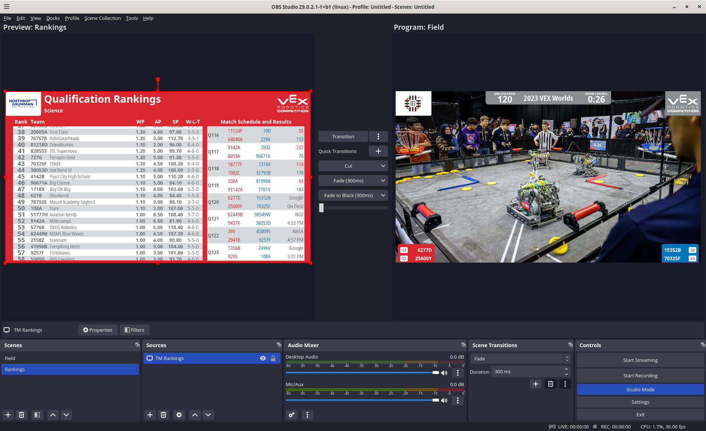

# vextm-obs-source

VEX Tournament Manager display source plugin for OBS Studio.



## Features

* Direct integration of the Tournament Manager audience display into OBS. No need for screen capture or input hardware.  This is the most efficient way of getting Tournament Manager audience displays into OBS. Great for both producing a video feed for a projector as well as streaming your event to popular streaming services supported by OBS!
* Native transparency support. Overlay the TM audience display on a video source directly without the need to configure a chroma key.
* Screen pinning support. You can set up separate scenes in OBS that only show a single TM display. For example, one scene will only have the Intro/In-Match TM screens while another scene has Match Results. This lets you use OBS to transition between the screens for more control. Use a stinger transition for a more professional look.

## Support

Please note this is *unofficial software*. It is not supported or endorsed by VEX Robotics or the REC Foundation in any way. Please do not contact VEX or RECF with any issues related to this plugin.

If you think you have found a bug, please [log an issue](https://gitlab.com/dwabtech/vextm-obs-source/issues). We request that you do not use the issue tracker for support requests.

## Download

Binaries for Windows and Linux x86\_64 are available in the [Releases](https://gitlab.com/dwabtech/vextm-obs-source/-/releases) section.

## Installation

The latest version of Tournament Manager for Windows or Linux should be installed before you begin.

The Windows version of the plugin is distributed as an installer executable file. To install, double-click the downloaded .exe file.

The Linux version is distributed as a .zip file. To install from the command line:
```
unzip -d ~/.config/obs-studio/plugins/ vextm-source.zip
```

After that, restart OBS Studio and it should load the new plugin.

## Usage

**NOTE**: It is not advisable to run OBS Studio on the same computer which is being used for scorekeeping with Tournament Manager or acting as the Tournament Server. Use a separate PC dedicated to OBS Studio with a network connection to Tournament Manager.

In OBS Studio, select your desired scene and then click the `+` button under `Sources`. Choose `VEX TM Display`. You will be prompted for some settings. Server address and tournament password should be filled in as appropriate - this is similar to setting up a remote TM display on another computer.

`Screen to show` allows you to "pin" the display source to a single display type. You might use this for example to create a source that always has the rankings available if you want to transition to that in between matches (rather than requiring the scorekeeper to do it using TM's built-in display controls). For basic usage, just leave this set to `All`.

`Field Set ID` can be left at 0 if you are not using more than a single field set in Tournament Manager. If you are using more than 1 field set, you can also leave this value at 0 and then you will get a separate prompt from the TM display program asking you to choose your field set. Otherwise, you can set this value to your field set ID so that you can shut down OBS Studio and restart it without being prompted by TM. Unfortunately, there is currently no easy way to look up a field set ID, however in most cases the field set IDs just start at 1 and count up from there, so finding it by trial and error shouldn't be hard.
